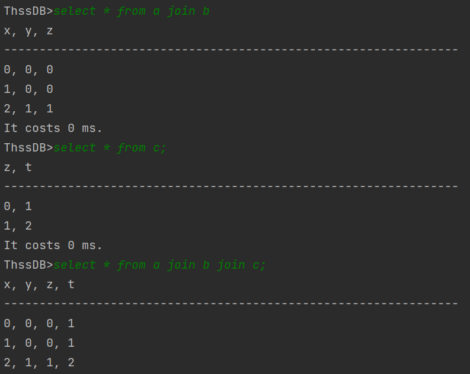
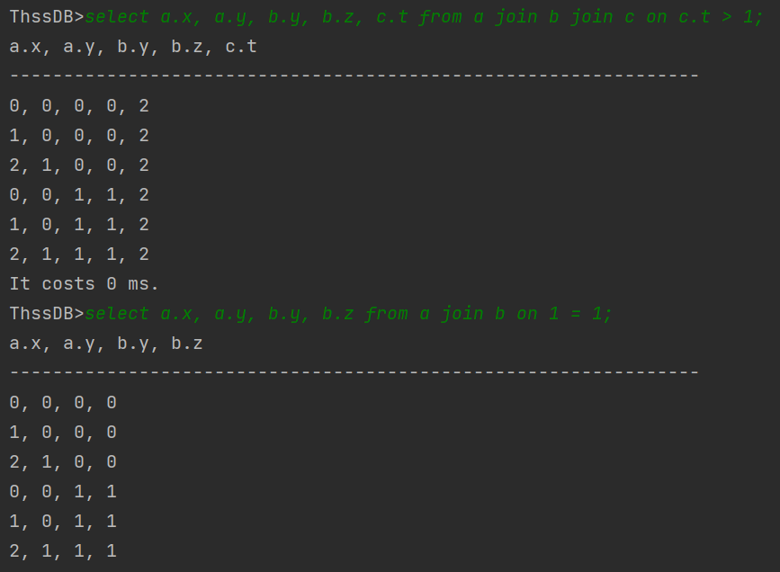
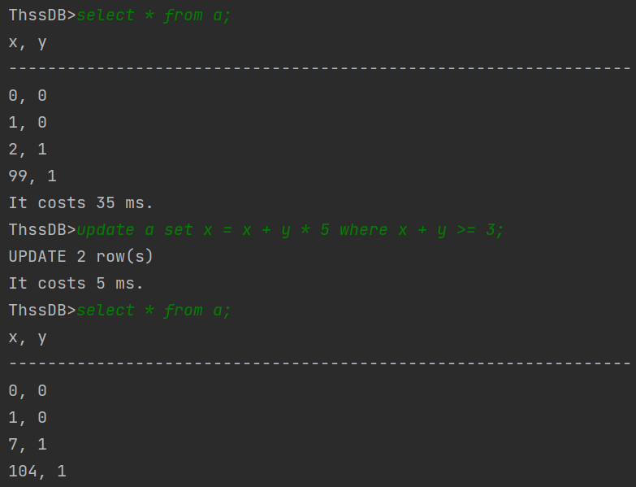
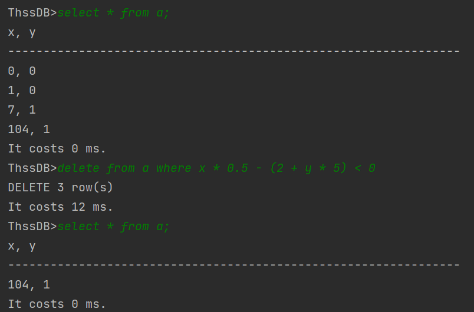
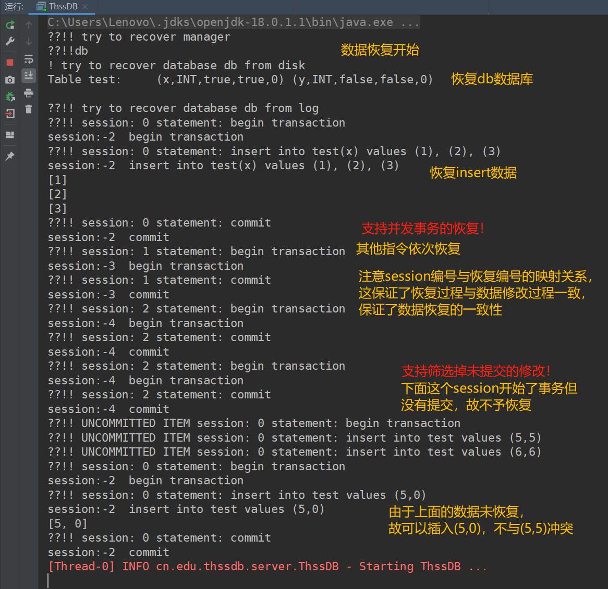

# THSSDB 用户文档

## 小组成员

游嘉诚  软件91  2019013246

张嘉林  软件93  2018013323

朱思漠  软件92  2018012209

## 运行方法

### 构建项目

安装Maven和Java JDK。使用Intellij Idea打开本项目根目录，点击Maven-生命周期-install，安装依赖项。


在Idea中运行`src\main\java\cn\edu\thssdb\server\ThssDB.java`文件中的`ThssDB.main()`方法即可运行服务器，运行`src\main\java\cn\edu\thssdb\client\Client.java`文件中的`Client.main()`方法即可运行客户端。

### 运行服务器

在Idea中运行`src\main\java\cn\edu\thssdb\server\ThssDB.java`文件中的`ThssDB.main()`方法即可运行服务器。

### 运行客户端

在Idea中运行`src\main\java\cn\edu\thssdb\client\Client.java`文件中的`Client.main()`方法即可运行客户端。

如果您需要使用客户端进行数据库访问，请先启动服务器。

如果您需要使用多个客户端，则需要在Idea中设置允许运行多个Client实例。

### 连接数据库

在客户端中输入以下语句即可连接数据库。

```mysql
connect;
```

### 断开连接或退出客户端

在客户端中输入以下语句即可断开与数据库的连接。

```mysql
disconnect;
```

在客户端中输入以下语句即可退出客户端。

```mysql
quit;
```

## 功能方法

### 创建数据库

以下语句是创建数据库的一个示例，其中db是新建的数据库名称，可以使用您需要的名称。当您使用SQL语言在THSSDB中进行操作的时候，请务必注意，SQL语言是大小写不敏感的，大写或小写字母会被视为相同的输入（下同）。

```mysql
create database db;
```


### 创建数据表

以下语句是创建数据库的两个示例，其中newtable和a是新建的数据表名称，可以使用您需要的名称。

```mysql
create table newtable (x int, y int, primary key(x));
create table a (x int not null, y string(20) not null, z float, t double, w long, primary key(x));
```

这个数据表中，每个元组包含x, y两个属性，变量类型均为int型整数，x为主键。


我们还可以对数据做非空（not null）标注，而主键（primary key）是蕴含not null的。如上图中无论是否标注not null，x都不允许是空值。

下图可以看出非空约束的作用：


指定不存在的主键将会报错：


未指定主键也会报错：


### 删除数据表

以下语句是删除数据表的一个示例，其中tb是被删除的数据表名称，如果该数据表本就不存在，则会返回错误信息。

```mysql
drop table tb;
```


### 查看数据表的模式定义

以下语句是查看数据表模式定义的一个示例，其中tb是您要查看的数据表名称。

```mysql
show table tb;
```

返回格式示例为（以上面的newtable表为例）：

```
newtable (
  x INT PRIMARY KEY
  y INT
)
```

而对表a的测试结果如下图：（由于primary key蕴含了not null，所以标注为primary key的列不再显示not null）


### 向数据表中插入数据

以下语句是向数据表中插入数据（元组）的两个示例，其中db是新设置的数据库名称。

```mysql
insert into newtable values (1,2);
insert into newtable(x) values (2), (3), (4);
```

则第一个语句会插入元组 (x=1, y=2)，第二个语句会插入元组 (x=2, y=NULL), (x=3, y=NULL), (x=4, y=NULL)。如果插入冲突的元组，则会返回错误信息。

以下是基于上面的表a运行示例。

支持指定列顺序/指定部分列，未指定的列将插入null


不指定时需要给出全部列的值


指定的列中若不包含not null列，因为插入null会报错：


重复的主键将会报错：


### 查询数据

以下语句是查询语句的一个示例，表示选择a表中的所有数据。

```mysql
select * from a;
```

接下来展示连接运算`join`的功能：


查询语句可以进行投影（选择一些属性进行输出），`join`语句支持用`on`关键字指定连接的条件：


查询语句支持代数运算：


查询语句支持逻辑运算：


查询语句支持在`on`子句和`where`子句中都包含逻辑运算：


查询语句支持多张表进行`join`运算：





### 更新数据




### 删除数据




### 开启事务与结束事务

正常情况下，对数据库的访问通过“事务”（transaction）实现，当一个事务提交时，这个事务造成的影响才被认为真正实现或完成。

一般来说，您在客户端的每一个指令，都会被套在`begin transaction;`和`commit;`之间进行，这意味着每一个语句执行结束后，客户端会自动为您提交（commit）。

然而，如果您手动在客户端执行语句

```mysql
begin transaction;
```

那么上述自动套壳的机制会中止，直到您手动执行

```mysql
commit;
```

之前，这个事务都不会结束，您的操作都属于这个事务。

这会产生两个影响：

1. 如果您对数据做了修改，但最终没有提交（commit）：当服务器重启时，服务器将认为您的指令没有提交，而不再复行您的修改指令。
2. 如果您对数据有写操作，但是尚未提交，那么其他对于该部分数据有读请求的用户将无法访问这部分数据，直至您提交。

## 并发与恢复

### 事务并发


### 恢复

实现了事务的WAL机制，在数据操作时写入log，而在数据库重启的时候按照log进行数据恢复。

下图是数据恢复的过程以及讲解：



总的来说，我们实现了对写入log的读取，指令的复行，数据的恢复。另外，我们支持多事务的恢复机制，并且支持对未提交修改的筛选，保证数据的一致性。